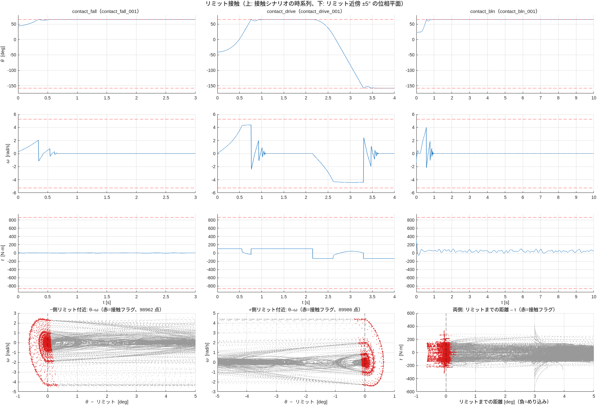

# リミット接触シナリオ レポート（issue #11）

実施日: 2026-10-06 / MATLAB R2025a / 親資産 `robotArmSurrogate-matlab` @ 5a7c690

## 背景
Phase 3（#9）で生成した 338 シナリオは、リミットに一度も接触しなかった（励振モデルのソフトバリアが自由落下・励振にも効くため。最小 −157.0°、最大 +64.1°、リミットから 1° 以内は 127 サンプルのみ）。機械ストッパの挙動を学習対象にするため、バリアをリミットの外側に移した接触シナリオを追加した。

## 追加したシナリオ（56 本）
バリアは位置をリミットの外側（可動域の 110%）に置いて実質無効にし、速度バリアは最大角速度の 80%（4.19 rad/s）にして衝突速度を上限内に収める。静止サンプルが増えすぎないよう継続時間は短めにした。

| パターン | 本数 | 長さ | 内容 |
|---|---|---|---|
| `contact_fall` | 12（両側 6 ずつ） | 3 s | 摩擦で動かない領域（約 ±19°）の外から自由落下し、重力方向のリミットに衝突 → 反発・押し付けて静止（微小 BLN） |
| `contact_drive` | 24（両側 12 ずつ） | 4 s | リミット方向へ定トルク（0.2〜0.5 τ_ref）で衝突・押し付け → 1.5〜2.2 s で反転し反対側へ（**1 本で両側に接触**） |
| `contact_bln` | 20（両側 10 ずつ） | 10 s | 大振幅 BLN（1.0 τ_ref、5 Hz）にバイアス（0.15 τ_ref）を足してリミットへ接触 |

- 既存の 338 シナリオのキャッシュは再利用し、追加の 56 本だけを生成した（約 37 分）。接触シナリオは既存シナリオの後ろに追加し、既存のシード・初期状態・split を変えない（テストで確認）
- パラメータ（初期状態、トルク、反転時刻）はシナリオのシードから決まり、再現できる

## 事前の実測（設計の根拠）
バリアを外した励振モデルで、±150/±400 N·m の往復と自由落下を実行した。
- ±150 N·m 往復で **−側・+側の両方に 0.7° めり込み**、最大 4.96 rad/s で衝突。±400 N·m は 5.30 rad/s で `qdMax`（5.236）を超過 → 速度バリアを 80% に設定
- 自由落下はリミットに押し付けたまま静止し、接触割合は 73〜86%（静止サンプルが多い）→ 継続時間を短くした

## 結果（full 394 シナリオ、2,856,681 遷移）
- **検証 15 項目すべて合格**（接触に関する 3 項目を追加: 両側への接触、接触遷移 1,000 件以上、動的な接触が各側 1,000 件以上）
- q の範囲は −158.7° 〜 +65.64°（リミットを最大 0.65° 超える）。|dq| 最大 4.543 rad/s（上限内）
- **接触の遷移は 188,948 件**（全体の 6.6%、接触シナリオ内では 56.9%）。リミットから 1° 以内は −側 107,585、+側 98,101 サンプル（#9 では計 127）
- 最大めり込み: −側 0.65°、+側 0.64°。初回衝突速度: −側 1.2〜4.4 rad/s（中央値 4.2）、+側 2.0〜4.4 rad/s（中央値 4.2）。中央値が 4.2 に寄るのは、定トルクで加速したあと速度バリア（4.19 rad/s）で頭打ちになるため

上段は接触シナリオの時系列（衝突 → 反発して ω が反転 → 減衰振動 → 押し付けて静止、`contact_drive` は反転して反対側へ）、下段はリミット近傍 ±5° の位相平面（赤 = 接触フラグ）。

### 接触遷移の内訳（要認識）
| 区分 | 件数 | 割合 |
|---|---|---|
| 動的な接触（\|dq\| > 0.02 または \|Δdq\| > 0.005）: −側 7,047 + +側 5,092 | 12,139 | 6.4% |
| 静止して押し付けている | 176,809 | 93.6% |

- 接触の遷移の大半は静止したまま押し付けている。ただし、**次状態は現在状態と同じ（トルクを変えても位置が動かない）**という挙動も、ストッパの学習対象として意味がある
- 動的な接触（衝突・反発・離脱）は各側 5,000〜7,000 件と少なめ。より増やしたい場合は、衝突回数の多い短い往復シナリオを追加できる
- **接触遷移での解析モデルの加速度残差比は 1.08**（接触が無い遷移では 0.035）。ストッパは `M·ddq = τ + mgL·sin θ − 摩擦` では説明できず、新しい情報が加わったことを示す

### ゲート G3 の目標値は引き続き達成
3 次元占有率 25.6%（#9: 21.6%）。PTP が占有セルに入る割合は 3 次元 **94.7%**（目標 90%）、2 次元 100% / 99.9% / 100%（目標 95%）。2 次元占有率 87.5% / 69.5% / 78.2%（目標 60%）。τ の 0.5〜20 Hz の最小パワー −21.7 dB（目標 −30 dB 以内）。

## 方針の変更
- **リミット接触サンプルは既定で学習対象に含める**（`j2BuildFlat` の `excludeAtLimit` の既定を `false` に、`j2Coverage` も同様）。フラグ `atLimit` は残し、拘束の有無で比較・除外できる
- **正規化統計は train の全遷移から算出**（以前は非拘束のみ）
- 解析モデルとの整合検証（`validateJ2Data`）では、解析モデルにストッパが無いため拘束遷移を除く（残差比 0.035）
- Phase 2 レポートの「接触しない」記述と、要件 FR-3・§7 #3 を更新した

## 実装
- `j2ScenarioSet` / `runJ2Scenario`: 3 パターンを追加（新フィールド `dqSoftFrac`, `ampRel2`, `tFlip`, `side`）
- `genJ2Dataset`: 統計を全 train 遷移から算出。`validateJ2Data`: 接触の検査を追加。`j2Coverage`: 接触の指標（動的／静止の内訳、初回衝突速度、めり込み）と `coverage_contact.png` を追加
- `tools/j2_run_all.sh`: 未生成シナリオの生成 → 組み立て・検証・評価を 1 プロセスで連続実行
- テスト: シナリオ表 11 件（接触の追加が既存を変えないことを含む）、シナリオ実行 17 件（接触 4 本、両側への衝突）、データ 5 件、カバレッジ 4 件

## 後続課題
1. 動的な接触の増強（衝突を繰り返す短い往復、衝突速度の分散を広げる）
2. 静止押し付けの割合（93.6%）が学習に与える影響の確認（サンプル重み・間引きの検討）
3. #9 で挙げた課題: バリア内部での大トルク励振、step のバリア振動の抑制、J3 固定姿勢のバリエーション
