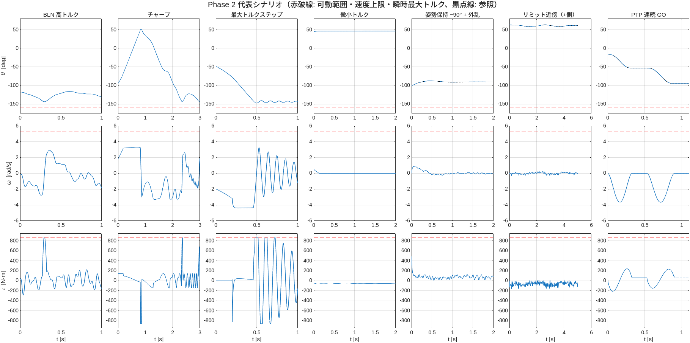

# Phase 2 レポート — 励振・シナリオ・PTP ベンチマーク（issue #7）

実施日: 2026-10-06 / MATLAB R2025a

## 成果物
| ファイル | 内容 |
|---|---|
| `src/model/j2Params.m` | J2 単軸の導出パラメータ（実効慣性 M、mgL、摩擦、制限、トルク容量） |
| `src/plant/buildJ2Excitation.m`, `setJ2Barrier.m` | 開ループ励振モデル（励振トルク＋ソフトバリア＋トルク飽和）、安全帯の設定 |
| `src/plant/buildJ2ClosedLoop.m` | PD＋フィードフォワード閉ループモデル（トルク飽和付き）。姿勢保持＋外乱・PTP に使用 |
| `src/plant/runJ2Sim.m` | 外部入力を与えて実行する汎用関数 |
| `src/control/j2PtpTrajectory.m`, `j2PtpSegTime.m`, `j2SmoothRef.m`, `j2Feedforward.m` | PTP 5 次多項式軌道、区間時間、滑らかな参照、解析 FF |
| `src/data/j2Sobol.m` | Sobol 列の自前実装（4 次元まで、digital shift 付き。Statistics Toolbox 不使用） |
| `src/data/j2Signal.m` | 励振信号（BLN・チャープ・ステップ） |
| `src/data/j2ScenarioSet.m`, `runJ2Scenario.m` | シナリオ表（full 338 本 / small 19 本）、1 シナリオの実行 |
| `test/test_j2_signals.m`, `test_j2_scenarioset.m`, `test_j2_scenarios.m` | 単体テスト 6 + 9 件、シナリオ実行テスト 13 件 |

## 検証結果
- `test_j2_signals`（6 件）、`test_j2_scenarioset`（9 件）、`test_j2_scenarios`（13 件、約 250 s）すべて合格
- 開ループ励振: バリア有りで ±400 N·m 往復でも J2 は可動範囲内、最大速度 3.75 rad/s（上限 5.24）、最大トルク 835 N·m（バリアなしでは速度 25.8 rad/s・リミット超過）
- PTP 閉ループ（速度スケール 0.6、5 次多項式＋解析 FF＋PD wn=30）: 追従誤差 最大 0.012°、RMS 0.004°
- 姿勢保持＋外乱（86 N·m の BLN 外乱）: 参照からの偏差 0.4〜2°（外乱による変位 ≒ 外乱/Kp = 0.9° ＋ 参照の変動）
- シナリオはシードで再現可能（同一シナリオを 2 回実行して一致）

## 収集計画（full）
| フェーズ | パターン | 本数 | 長さ | 振幅 / 帯域 | 初期状態 |
|---|---|---|---|---|---|
| 1 | bln_normal | 60 | 10 s | 0.5 τ_ref / 20 Hz | Sobol |
| 1 | bln_high | 30 | 5 s | 1.0 τ_ref / 20 Hz | Sobol |
| 1 | bln_low | 30 | 15 s | 0.2 τ_ref / 5 Hz | Sobol |
| 1 | freefall | 6 | 3 s | 0.05 τ_ref / 5 Hz | Sobol |
| 2 | 姿勢保持 7 姿勢 × 20（0, +30, +60, −45, −90, −120, −150°） | 140 | 5 s | 外乱 0.3 τ_ref / 20 Hz、参照 ±10° / 1 Hz | 姿勢 |
| 2 | chirp | 10 | 20 s | 0.5 τ_ref、0.1→20 Hz | Sobol |
| 2 | step | 20 | 2 s | ±τ_peak（860 N·m、飽和） | Sobol |
| 2 | micro | 20 | 10 s | 保持トルク＋0.05 τ_ref | Sobol |
| 2 | nearlimit | 10 | 10 s | 外乱 0.5 τ_ref、リミットの 4° 内側 | 姿勢 |
| ベンチ | ptp 速度スケール 0.2 / 0.4 / 0.6 / 0.8 × 3 | 12 | 最大 60 s | PD＋FF、6 点連続、停留 0.2 s | 軌道 |

- 合計 338 シナリオ、励振・保持の継続時間 約 2,458 s（1 kHz で約 246 万サンプル）＋ PTP
- train / val / test はパターンごとに 70 / 15 / 15（シード固定）、PTP は `benchmark`
- τ_ref は定格トルク 286.8 N·m（引継ぎ資料の TAU_MAX=300 N·m 相当）。step のみ瞬時最大 860 N·m
- 引継ぎ資料の表は「フェーズ1 = 140 本」だが、各行の本数の合計は 126 本、フェーズ2 は 160 本ではなく 200 本。表の各行の本数を採用した

## 判断・発見
1. **実効慣性は 6.09 kg·m²**（armature 込み）。シミュレーション実測 6.084。Phase 0 レポートの「8.4」は二重計上の誤りで訂正した
2. **リミット近傍は開ループの押し付けでは取れない**: +65° でも −158° でも重力がリミット方向に働くため、押さなくても張り付いたまま動かず、接触が 84〜89% を占めた。閉ループ保持（参照をリミットの 4° 内側）に変更し、リミットから 1.7〜3.2° の範囲を動く（拘束 0%）データになった
3. **リミット拘束サンプルの扱い（決定）**: 生データに残し、割合を返す。既定では学習用から除外する（FR-3）
4. **リミットに実際に当たるのは自由落下シナリオ**（|θ| > 約 19° の初期値は重力でリミットへ落ちる）。この領域のサンプルは拘束としてフラグされる
5. **初期角速度非ゼロの警告**: 短い警告 1 行（初期条件の最初の求解が収束しませんでした）が残る。Phase 1 と同じ原因で、結果には影響しない
6. **実行オーバーヘッド**: 1 シナリオあたり約 10〜15 s の Simscape コンパイルがあり、全 338 本で約 1.2 時間。継続時間ぶんの実行（約 2,500 s × 約 5〜6）と合わせて約 5 時間の見込み。Fast Restart の利用は Phase 3 で検討する
7. PD は連続形（wn=30 rad/s、ζ=1）で、ソルバ刻み 8 kHz で評価される。親資産のような離散制御器ではない

## ゲート G2
全シナリオ種別（励振 8 種、姿勢保持 7 姿勢、リミット近傍、PTP ベンチマーク）を 1 本ずつ実行でき、バリア・飽和が意図どおり働くことを確認した ✔
