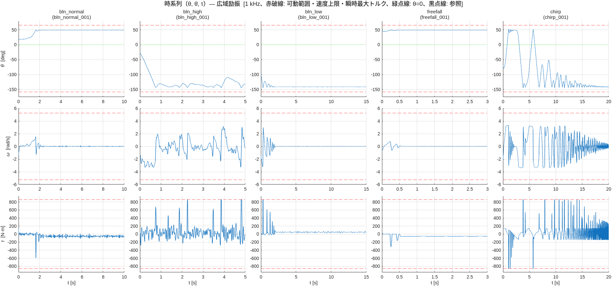
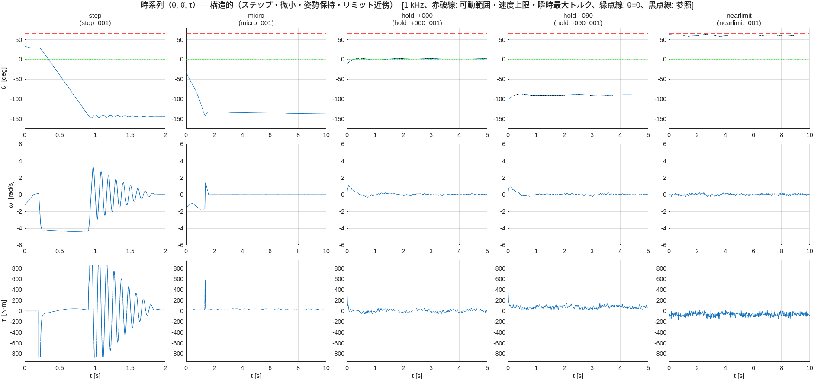
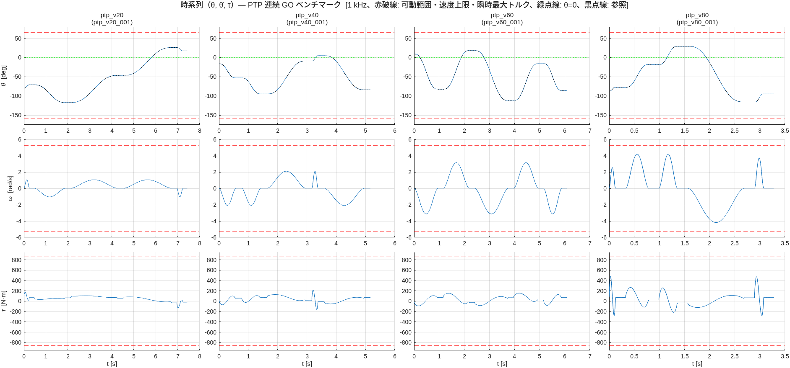
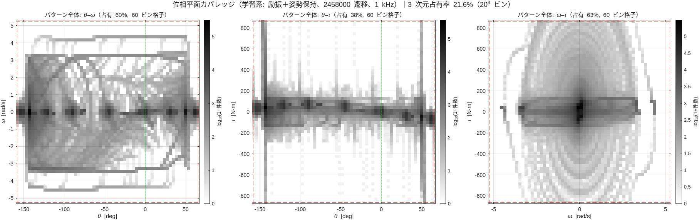
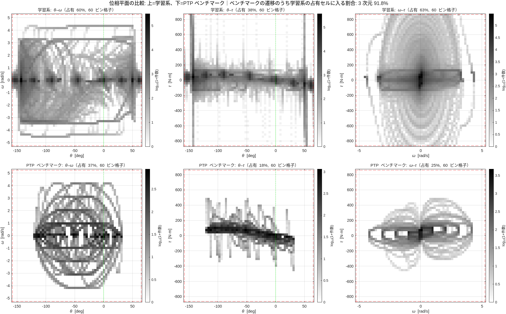
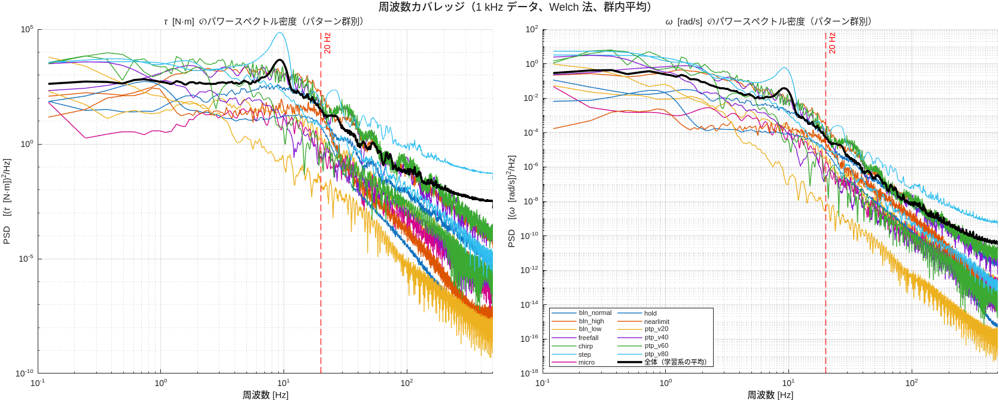
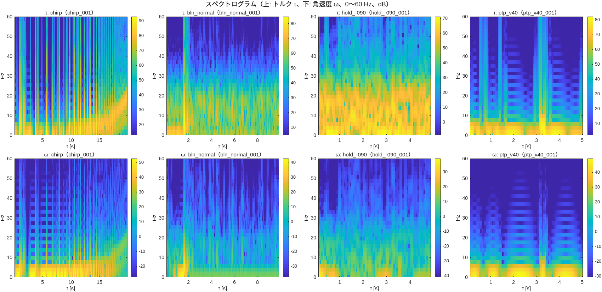

# Phase 3 レポート — データ生成とカバレッジ評価（issue #9）

実施日: 2026-10-06 / MATLAB R2025a / 親資産 `robotArmSurrogate-matlab` @ 5a7c690

## 成果物
| ファイル | 内容 |
|---|---|
| `src/data/j2Downsample.m` | 8 kHz → 1 kHz 変換（状態は瞬時値を間引き、トルクは区間平均） |
| `src/data/genJ2Dataset.m` | シナリオ単位キャッシュ・再開・分担実行、リミット拘束フラグ、train のみの統計、マニフェスト |
| `src/data/validateJ2Data.m`, `j2BuildFlat.m` | 検証（11 項目）、フラット化（引継ぎ資料の正規化形式にも対応） |
| `src/analysis/j2Coverage.m` | 時系列・位相平面 3 種・周波数（PSD、スペクトログラム）の PNG と数値指標 |
| `tools/` | 分担ワーカー、完了後の組み立て・検証・評価、連結スクリプト |
| `test/test_j2_dataset.m`, `test_j2_coverage.m` | 単体テスト 4 + 3 件 |
| `reports/issue-9/` | full の評価 PNG 7 枚と `metrics.json`（`preview_small/` は small のプレビュー） |

## 設計判断: 1 kHz への変換
- **状態 (q, dq) は瞬時値をそのまま間引く**（ローパスなし）。目的は 1 ステップ遷移 `x_{k+1} = f(x_k, u_k)` の教師データで、状態にフィルタをかけると遷移を歪めるため。親資産の `c8Downsample` は加速度の差分用でアンチエイリアス付きであり、目的が異なる
- **トルクは区間 [t_k, t_{k+1}) の 8 サンプル平均**。ステップ・飽和・バリアの切替でも遷移と整合する。区間先頭の瞬時値は `tauInst` に残す
- 正規化統計は train かつ非リミット拘束の遷移のみから算出（val/test のリーク防止）
- 引継ぎ資料のスケール（`DTHETA_MAX` = 5.236 rad/s、`TAU_MAX` = 860.4 N·m、`D_THETA_MAX` = 5.2e-3 rad、`D_DTHETA_MAX` = 0.141 rad/s）を `ds.scale` に実機値で保存

## 生成結果（full）
- 338 シナリオ、**2,524,681 遷移**（1 kHz）。train 229 / val 46 / test 51 / benchmark 12
- 生成時間: shard 2 本で約 4 時間（実行は 1 プロセスずつ。メモリの都合で並列にできず、Parallel Computing Toolbox も未許諾）
- データセット: `data/j2_dataset_full.mat`（50 MB、git 管理外）。8 kHz 生データは `data/cache/` に single で保存。再生成は `genJ2Dataset` の再実行で再開できる

## 検証結果（`validateJ2Data`、11 項目すべて合格）
| 項目 | 値 |
|---|---|
| 有限性 | NaN・Inf なし |
| \|τ\| ≤ tauPeak | 最大 860.4 N·m |
| \|dq\| < qdMax | 最大 4.379 rad/s（上限 5.236） |
| q の範囲 | −157.0° 〜 +64.1°（可動範囲 −158° 〜 +65°） |
| 正規化統計 | train 非拘束のみ由来（再計算と一致） |
| **解析モデルとの 1 ステップ整合** | `M·ddq = τ + mgL·sin θ − Bv·dq − Fc·tanh(dq/ε)` の加速度残差が加速度 RMS の **3.5%** |

## カバレッジ評価（20 ビン格子）
### 1. 時系列

### 2. 位相平面（θ–θ̇、θ–τ、θ̇–τ）

### 3. 周波数カバレッジ

### ゲート G3 の判定（目標値は 2026-10-06 に承認）
| 指標 | 目標 | 結果 | 判定 |
|---|---|---|---|
| PTP の遷移が学習系の占有セルに入る割合（3 次元） | ≥ 90% | **91.8%** | ✔ |
| 同（θ–θ̇ / θ–τ / θ̇–τ の 2 次元） | 各 ≥ 95% | 98.9% / 99.9% / 98.3% | ✔ |
| 2 次元占有率（θ–θ̇ / θ–τ / θ̇–τ） | 各 ≥ 60% | 78.8% / 69.3% / 76.3% | ✔ |
| τ の 0.5〜20 Hz のピーク比（最小パワー） | ≥ −30 dB | −21.7 dB | ✔ |
| 検証関数のエラー | 0 件 | 0 件 | ✔ |

参考: 3 次元占有率 21.6%（8,000 セル）。1 次元の占有は θ 100%、θ̇ 90%、τ 100%。τ のピークから −40 dB 以内の被覆は約 60 Hz、ω は約 20.5 Hz（BLN の 20 Hz と整合）。

## 発見（要認識）
1. **データはリミットに一度も接触しない**。励振モデルのソフトバリア（可動域の 85% 位置）が自由落下にも効くため、最小 −157.0°、最大 +64.1°。リミットから 1° 以内は 127 サンプル、2° 以内でも約 2,800 サンプル（0.1%）。リミット拘束フラグ（0.1° 以内）は実質無効で 0%。**機械ストッパの挙動は学習対象外**になる。Phase 2 レポートの「リミットに当たるのは自由落下」は誤りで訂正した。含めるにはバリアを外した接触シナリオを追加する
2. **θ–τ 平面の縦縞はバリア端の人工的な構造**: θ≈−141° と +48° でバリアが押し戻し、τ が ±860 N·m に張り付く。物理的に正しいトルクだが、「大トルク（|τ| > 300 N·m）は主にバリア付近」という偏りがある。内部の θ で大トルクのデータは薄い
3. **τ の PSD の 9 Hz のピーク**はバリアの固有周波数（wn = 60 rad/s ≒ 9.5 Hz）。step シナリオがバリアに当たって振動している
4. 質的には、倒立点近傍（|θ| < 10°）に 15.5 万、両リミット 10° 以内に各 13〜14 万遷移があり、θ 方向の被覆は広い

## 判断・実装中の修正
- `validateJ2Data` の `|tau| ≤ tauPeak` は、キャッシュが single のため相対 1e-6 を許容
- 小さい preset ではパターンごとの本数が 3 未満で全件 train になるため、train/val/test の存在は 100 本以上のときのみ必須
- `genJ2Dataset` が作業フォルダを削除しない漏れ、評価バッチの一時ファイルを残す漏れを修正・掃除した
- 周波数評価の FFT 長を 8192 に増やした（チャープが 0.1 Hz から掃引）。帯域の最小パワーは信頼できる 0.5〜20 Hz で評価

## 後続課題（別 issue の候補）
1. バリアを外したリミット接触シナリオの追加（機械ストッパの挙動を学習対象にする場合）
2. バリア内部での大トルク励振（偏りの是正）、step のバリア振動の抑制
3. フェーズ 3（能動学習補完）— 学習側の実装が前提
4. J3 固定姿勢のバリエーション
