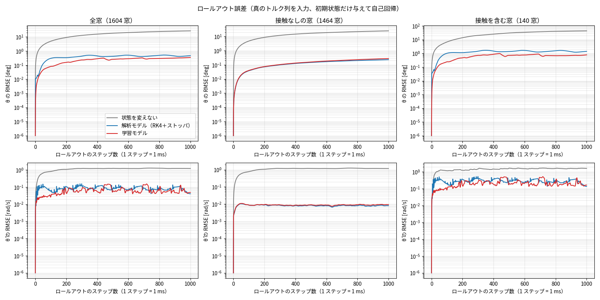
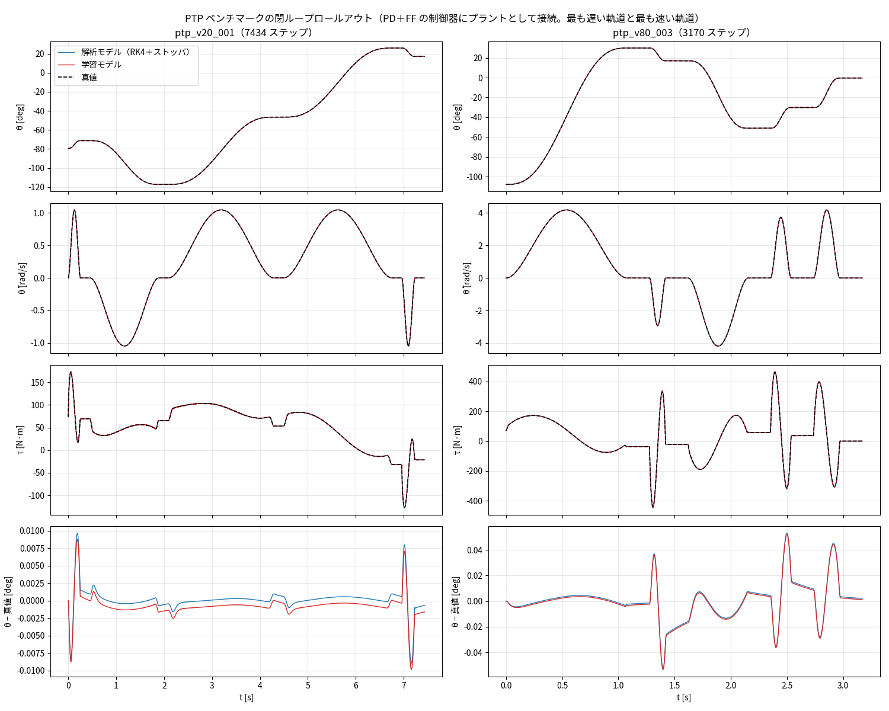
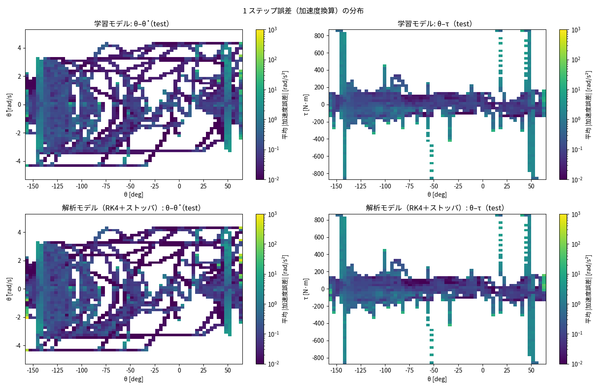

# 学習の試行 2 レポート — 解析モデル + NN の残差型（issue #25）

実施日: 2026-10-08 / Python 3.13、PyTorch 2.14（CPU、4 コア） / データ: `data/export/j2_flat_full.h5`（394 シナリオ、2,856,681 遷移）

#23 の最初の試行（[training_report.md](training_report.md)）の続き。純粋な NN は、接触なしの領域で解析モデルに勝てず、接触・バリア端で誤差が大きかった。解析モデルを土台にして、土台が外れる部分だけを NN に学ばせる**残差型**を試した。**1 シード・1 設定の最初の結果**で、ハイパーパラメータ探索は行っていない。

## 方法
```
次状態 = 解析モデルの 1 ステップ予測（ストッパ無し、RK4） + NN の補正
NN の入力 = [sin q, cos q, dq/DTHETA_MAX, tau/TAU_MAX] + 解析モデルの予測（spec 単位の Δq, Δdq）→ 6 列
学習の目標 = 真の次状態 − 解析モデルの予測（残差）。最後の層を 0 で初期化（開始時点は解析モデルそのもの）
```
MLP は #23 と同じ（256×3、SiLU、Adam、学習率 2e-3 → 1e-5、バッチ 4096、40 エポック、約 40 分）。損失の違いで 3 つの変種を比べた。

| run | 残差の標準化 | 損失 | 狙い |
|---|---|---|---|
| `residual` | 全遷移の標準偏差 | MSE | 標準（issue のとおり） |
| `residual_robust` | 接触なしの遷移の標準偏差 | Huber | 接触の巨大な残差に引きずられず、小さな残差を精密に学ぶ |
| `residual_dual` | 接触なしの遷移の標準偏差 | 2 項の MSE（全遷移を全遷移の σ で標準化 + 接触なしを接触なしの σ で標準化） | 接触と接触なしの両方を重視 |

背景: 残差の標準偏差（Δdq、spec 単位）は、全遷移で 0.108、接触なしでは 0.0033 と **約 32 倍の差**がある。接触の遷移（全体の約 7%）の巨大な残差が全体の標準偏差を支配するため、一律に標準化すると接触なしの小さな残差が損失にほとんど効かない（`residual` の懸念）。評価の追加として、接触遷移を**動的な接触**（衝突・反発・離脱）と**静止押し付け**に分けた。

## 結果

#### 1 ステップ誤差（加速度換算 RMSE [rad/s²]、小さいほど良い）

| 区分 | 純粋NN | 残差(MSE) | 残差(free+Huber) | 残差(dual) | 解析（ストッパ無し） | 解析（非弾性ストッパ） | 状態を変えない |
|---|---|---|---|---|---|---|---|
| test 全体（n=446,000） | 4.17 | 3.37 | 12.87 | 13.08 | 13.51 | 30.50 | 18.64 |
| test 接触なし（n=418,677） | 1.79 | 1.06 | 0.33 | 0.25 | 0.48 | 0.48 | 14.30 |
| test 接触あり（n=27,323） | 15.32 | 12.99 | 51.98 | 52.84 | 54.54 | 123.21 | 50.40 |
| 　└ 動的な接触（n=1,603） | 62.67 | 53.39 | 214.59 | 215.08 | 215.14 | 508.63 | 208.06 |
| 　└ 静止押し付け（n=25,720） | 2.17 | 1.26 | 0.19 | 9.10 | 16.58 | 1.79 | 0.19 |
| PTP ベンチマーク（n=66,681） | 1.11 | 0.15 | 0.17 | 0.17 | 0.15 | 0.15 | 9.08 |

#### 1 秒窓の開ループ（test、θ の RMSE [deg]）

| 区分 | 純粋NN | 残差(MSE) | 残差(free+Huber) | 残差(dual) | 解析（ストッパ無し） | 解析（非弾性ストッパ） | 状態を変えない |
|---|---|---|---|---|---|---|---|
| 全体・100 ステップ | 0.114 | 0.082 | 1.584 | 1.834 | — | 0.304 | 4.970 |
| 全体・1000 ステップ | 2.324 | 0.352 | 60.793 | 68.505 | — | 0.470 | 26.903 |
| 接触なしの窓・100 ステップ | 0.105 | 0.040 | 0.017 | 0.020 | — | 0.038 | 4.755 |
| 接触なしの窓・1000 ステップ | 2.389 | 0.278 | 0.327 | 0.339 | — | 0.231 | 24.724 |
| 接触を含む窓・100 ステップ | 0.188 | 0.245 | 5.360 | 6.206 | — | 1.021 | 6.821 |
| 接触を含む窓・1000 ステップ | 1.477 | 0.780 | 205.772 | 231.875 | — | 1.404 | 43.591 |

#### PTP ベンチマークの閉ループ

| 区分 | 純粋NN | 残差(MSE) | 残差(free+Huber) | 残差(dual) | 解析（ストッパ無し） | 解析（非弾性ストッパ） | 状態を変えない |
|---|---|---|---|---|---|---|---|
| 真値との θ の RMSE（12 本の平均）[deg] | 0.08556 | 0.007023 | 0.006958 | 0.006649 | — | 0.006888 | — |
| 最大の θ 誤差（12 本の最大）[deg] | 0.4966 | 0.05343 | 0.07418 | 0.06575 | — | 0.05299 | — |
| 参照への追従誤差 RMSE（平均）[deg] | 0.08561 | 0.004158 | 0.004891 | 0.004984 | — | 0.003951 | — |
| トルクの RMSE vs 真値（平均）[N·m] | 7.29 | 1.016 | 1.144 | 1.091 | — | 1.005 | — |
| 発散した本数（/ 12） | 0 | 0 | 0 | 0 | — | 0 | — |

（参照への追従誤差の真値（記録）は平均 0.0030°）

（`residual_dual` は val 損失が 12 エポックで最小となり、その後は悪化したため、そのチェックポイントを評価した。早期終了なしで 40 エポック学習し直しても同じチェックポイントが選ばれた。）





## issue の 3 つの問いへの答え
### 1. 接触なしの精度は解析モデル並みになったか → はい（標準の残差型）。さらに上回る変種もある
- **接触のない全パターンで、`residual` の 1 ステップ誤差は解析モデルと一致**（bln 0.46、hold 0.25、freefall 0.04 など。差は最大 0.0024 rad/s²）。純粋な NN は群別で 1.4〜8 倍悪かった（bln 2.4 倍、hold 4.1 倍、freefall 7.3 倍など）。NN は接触なしの領域に余計な補正を足していない
- 「接触なし 1.06 対 0.48」の差は、**接触シナリオの中で接触フラグの付かない遷移**（24,677 件、接触の前後など）から来ている。そこでの RMSE は純粋な NN 5.94、`residual` 3.90、解析モデル 0.28。NN が、まだ接触していない状態から「接触の補正」を出してしまっていると考えられる
- `residual_robust` / `residual_dual` は、接触なしで**解析モデルを上回った**（0.33 / 0.25、解析モデル 0.48）。NN は、解析モデルが外す小さな構造（バリア端など）も学べる
- ただし **1 ステップの精度向上は、1,000 ステップのロールアウトには反映されなかった**。接触なしの窓で 0.327° / 0.339°（`residual` 0.278°、解析モデル 0.231°）。小さな偏りが積み重なるためと考えられる（未検証）
- **PTP の閉ループ**: 3 つの残差型はすべて解析モデルと同等（真値との θ の差 0.0066〜0.0070°、追従誤差 0.0042〜0.0050°。真値 0.0030°）。**純粋な NN（0.086°）の約 12 倍良い**

### 2. 接触・バリア端の誤差は純粋な NN より下がったか → 標準の `residual` では下がった。他の 2 変種は接触を学べなかった
- **`residual`**: 接触あり 12.99（純粋な NN 15.32）、動的な接触 53.4（62.7）、静止押し付け 1.26（2.17）。**接触を含む窓の 1,000 ステップは 0.78°で、純粋な NN（1.48°）と解析モデル（ストッパ付き 1.40°）の両方を上回った**。1 秒窓の全体も 0.35°で、解析モデル単体（0.47°）より良い
- **`residual_robust` / `residual_dual`**: 動的な接触が 214.6 / 215.1 で、「状態を変えない」（208）や解析モデル（ストッパ無し 215）と同じ。**接触を学べていない**。土台の解析モデルにストッパが無いため、NN がストッパを再現しないとアームがリミットを突き抜け、**1 秒窓の開ループが破綻**した（全体 60.8° / 68.5°、発散率 0.4% / 0.6%）。一方で静止押し付けは `residual_robust` が 0.19（「状態を変えない」と同等、`residual_dual` は 9.10）
- 原因の仮説（**未検証**）: ① 残差を接触なしの標準偏差で標準化すると、接触の目標が約 30〜100σ の大きな値になり、最後の層を 0 から育てる NN が追いつけない。② Huber 損失は大きな残差の勾配を抑える。③ `residual_dual` は train（1.18）と val（1.42）の乖離があり、接触の特徴が過学習した可能性がある

### 3. 誤差は動的な接触と静止押し付けのどちらに偏っているか → 動的な接触に圧倒的に偏る
- test の遷移のうち、**動的な接触は 1,603 件（0.36%）だけ**だが、二乗誤差の合計に占める割合は、純粋な NN で 81%、`residual` で **90%**、`residual_robust` で 100%
- **静止押し付け**（接触の 94%）は、「状態を変えない」（0.19 rad/s²）が、純粋な NN（2.17）や標準の残差型（1.26）より良い。ストッパ付きの解析モデルは 1.79。つまり「接触で学習の価値が出る」の実体は、**動的な接触（衝突・反発・離脱）**
- 動的な接触の誤差は、`residual` でも 53.4 rad/s²（「状態を変えない」の 3.9 倍良いが、絶対値はまだ大きい）

## 考察
1. **残差型は有効**: 標準の `residual` は、接触なしを解析モデル並みに保ちつつ、接触を純粋な NN より良く再現し、閉ループは解析モデルと同等、1 秒窓の開ループは解析モデル単体を上回る（0.35° 対 0.47°）。純粋な NN に対する改善が最も大きいのは閉ループ（約 12 倍）と 1 秒窓（約 6.6 倍）
2. **損失の設計が決定的**: 接触なしを精密に学ぶ設計（`robust`/`dual`）は接触を学べず、破綻した。逆に接触を重視する標準の設計は、接触なしの精度を解析モデル並みで止める。**両立には、出力の単位（スケール）と損失の重みを分けて設計する必要がある**
3. **val 損失は、接触の外れ値で大きく揺れる**: `residual` でも 10〜20 エポックで val が 0.66 → 0.89 と悪化した後に 0.068 まで下がった。**早期終了の待ち時間（既定 8 エポック）が短いと、接触を学ぶ前に打ち切られる**。`residual_dual` の最初の学習では、これで 20 エポックで終了した（後に打ち切りなしで確認し、結果は同じだった）。残差型の学習では `--patience` を大きくするか、無効にする
4. **静止押し付けは、モデルに任せず規則で扱う手もある**: 「状態を変えない」が最良。リミット付近でリミット方向のトルクなら状態を保持するゲートを入れると、動的な接触に学習を集中できる

## 制限と注意
- 1 シード・1 設定・40 エポック。差の大きさ（接触なしの 1 ステップ、閉ループの 12 倍など）は明確だが、小さな差（動的な接触の 53.4 対 62.7 など）は、複数シードで確かめていない
- 残差型は解析モデルの係数（M、mgL、Fc、Bv、ε）を**厳密に既知**として使う。ここでは Simscape の定義から取れたが、実機では係数の同定が必要で、係数がずれた場合の頑健性は未確認
- `robust`/`dual` が接触を学べなかった原因は、仮説のまま（上記）
- 評価した接触は、Simscape のソフトリミット（めり込み 0.65°）で、実機のストッパとは異なりうる

## 次の試行の候補
1. **`residual_dual` の出力の単位の修正**: 出力を全遷移の σ 単位に戻し、接触なしの項に重み (σ_全/σ_接触なし)² を掛ける。仮説①の検証と、接触と接触なしの両立
2. **接触のゲート・特徴量**: リミットまでの距離、リミット方向のトルクを入力に加える。静止押し付けを規則で扱う
3. **動的な接触の増強**（#16）と、静止押し付けの重み（#17）: 動的な接触が誤差の 90% を占めるため、データ側の効果が大きい
4. 複数シード、学習量・モデル規模の探索。val 損失の揺れに強い早期終了の基準（接触を除いた val 損失など）
5. 解析モデルの係数をずらしたときの頑健性（実機への適用の見通し）

## 再現
```bash
.venv/bin/python python/train.py --run residual --residual --epochs 40
.venv/bin/python python/train.py --run residual_robust --residual --y-scale free --loss huber --epochs 40
.venv/bin/python python/train.py --run residual_dual --residual --y-scale free --loss dual --epochs 40 --patience 100
.venv/bin/python python/evaluate.py --run residual --report-dir reports/issue-25/residual
.venv/bin/python python/compare.py "純粋NN=reports/issue-25/baseline" "残差(MSE)=reports/issue-25/residual" "残差(free+Huber)=reports/issue-25/residual_robust" "残差(dual)=reports/issue-25/residual_dual"
.venv/bin/python -m unittest discover -s python/tests -v      # 25 件
```
評価の図と指標は `reports/issue-25/{baseline,residual,residual_robust,residual_dual}/`。`baseline` は #23 と同じモデルを、接触の内訳つきの評価で再評価したもの。
