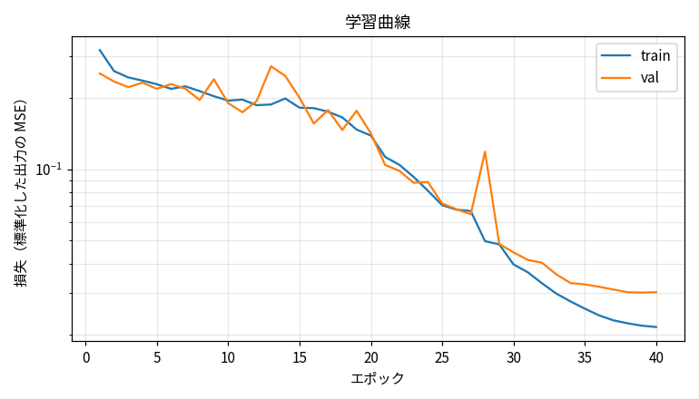
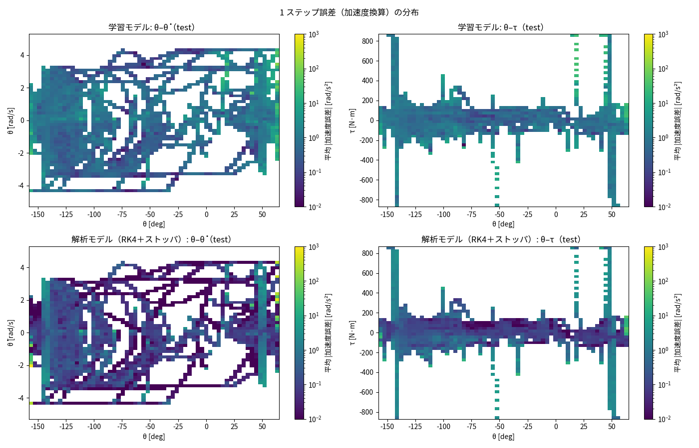
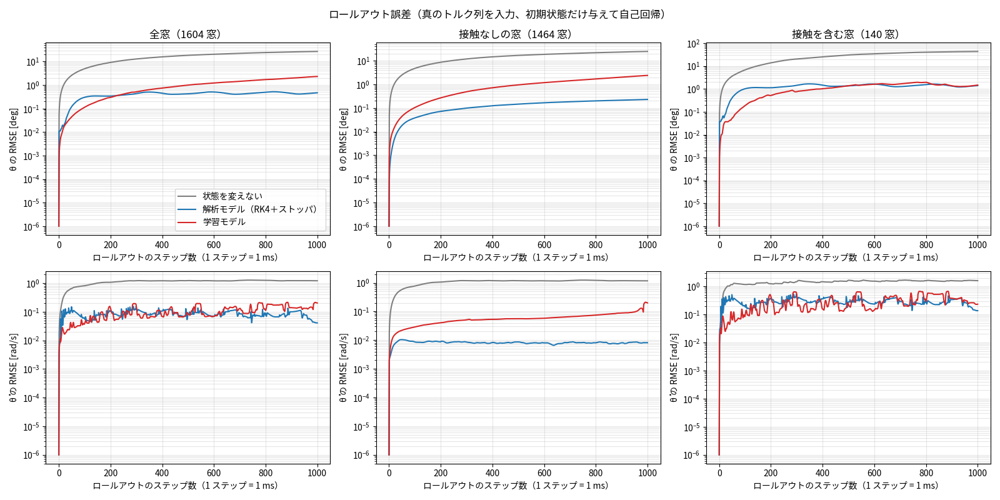
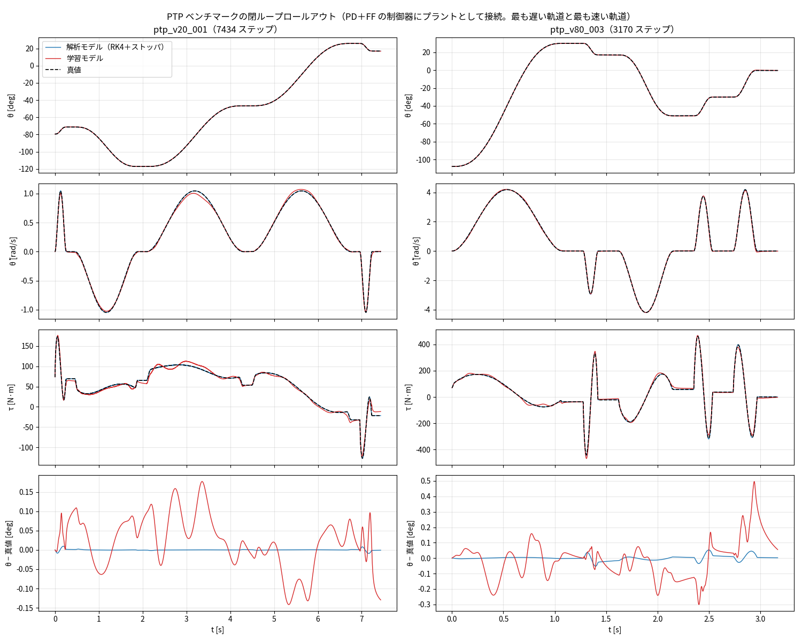

# 学習の試行 レポート — Neural State Model の学習と評価（issue #23）

実施日: 2026-10-07 / Python 3.13、PyTorch 2.14（CPU、4 コア）、h5py 3.16 / データ: `data/export/j2_flat_full.h5`（394 シナリオ、2,856,681 遷移）

## 目的と範囲
エクスポート済みデータ（#15）で、J2 の次時刻状態推論モデルを学習し、**1 ステップ誤差とロールアウト**で評価する。これは**最初の試行**で、ハイパーパラメータの探索や手法の作り込みは行っていない。

## 構成（`python/`）
| ファイル | 内容 |
|---|---|
| `j2nsm/data.py` | HDF5 の読み込み、シナリオ系列の復元 |
| `j2nsm/model.py` | MLP（`NSM`）。入力の標準化・出力の標準化、通常版と構造付き版 |
| `j2nsm/physics.py` | 解析モデルの基準線（RK4 ＋ 非弾性ストッパ） |
| `j2nsm/evaluate_lib.py` | 1 ステップ誤差、窓の開ループロールアウト、PTP の閉ループロールアウト |
| `train.py`、`evaluate.py` | 学習、評価（図と `metrics.json`） |
| `tests/` | 単体テスト 14 件（解析モデルの平衡・摩擦・ストッパ、モデルの形状・運動学、データの往復、窓の切り出し、制御器の閉ループ追従など） |

## 方法
- **入力** `X_spec = [sin q, cos q, dq/DTHETA_MAX, tau/TAU_MAX]` → **出力**（差分残差）`Y_spec = [Δq/D_THETA_MAX, Δdq/D_DTHETA_MAX]`（引継ぎ資料どおり）。損失は、train の標準偏差で標準化した出力の MSE
- **MLP** 4 → 256 → 256 → 256 → 2（SiLU、パラメータ 133,378）。Adam、学習率 2e-3 → 1e-5（ウォームアップ 200 ステップ ＋ コサイン減衰）、バッチ 4096、40 エポック、val で早期終了（打ち切りは発生せず）。リミット接触の遷移も含む（既定）。学習 1,958,000 行 / 検証 386,000 行
- **構造付き版**: Δdq のみを予測し、Δq は運動学 `dt·(dq + Δdq/2)` で求める（パラメータ 133,121）
- 学習時間: 通常版 40.4 分、構造付き版 37.7 分（CPU 4 コア）
- **基準線**: ① 解析モデル `M·ddq = τ + mgL·sin θ − Bv·dq − Fc·tanh(dq/ε)`（トルクを 1 ステップ一定として RK4、リミットでは位置を止めて外向きの速度を 0 にする単純な非弾性ストッパ付き）、② 状態を変えない（persistence / zero）

### 評価
1. **1 ステップ誤差**（val / test / PTP ベンチマーク）: 次状態の誤差を加速度換算 [rad/s²] で。リミット接触の有無、パターン群別
2. **1 秒窓の開ループロールアウト**（test、1,604 窓、250 ステップ刻み）: 窓の先頭の真の状態から、真のトルク列を与えて 1,000 ステップ自己回帰
3. **PTP ベンチマークの閉ループロールアウト**（12 軌跡、全長）: PD＋FF の制御器（MATLAB の `buildJ2ClosedLoop` と同じ wn = 30 rad/s、ζ = 1）にモデルをプラントとして接続し、参照軌道を追従させる。真値の閉ループ（記録）と比較する

### 全長の開ループ再生は評価に使わない（重要）
最初の評価の試作では、PTP を記録トルクの**開ループ再生**で全長（3〜14 秒）ロールアウトした。すると、モデルの学習前後に関わらず、**解析モデル（基準線）ですら θ の RMSE が 0.14〜71° ずれた**（12 軌跡のうち 8 軌跡で 1° 超）。θ = 0 まわりが不安定（成長率 √(mgL/M) ≈ 3.5/s）で、数秒で誤差が e^{10} 倍以上に増幅するため、正確なモデルでも丸め誤差で発散するからである。評価として意味がないので、長い区間は制御器を閉ループに入れて評価する（サロゲートの本来の用途でもある）。開ループは、誤差の増幅が小さい 1 秒の窓に限った。

## 結果
### 1 ステップ誤差（加速度換算 RMSE [rad/s²]、小さいほど良い）
**test**（446,000 遷移。目標の標準偏差 18.6）

| 区分 | 件数 | 学習モデル（通常） | 学習モデル（構造付き） | 解析モデル | 状態を変えない |
|---|---|---|---|---|---|
| 全体 | 446,000 | **4.17** | 4.53 | 30.50 | 18.64 |
| 接触なし | 418,677 | 1.79 | 2.20 | **0.48** | 14.30 |
| 接触あり | 27,323 | **15.32** | 16.17 | 123.21 | 50.40 |

PTP ベンチマーク（66,681 遷移、接触なし。目標の標準偏差 9.1）: 学習モデル 1.11（構造付き 1.30）、解析モデル **0.146**、状態を変えない 9.08。val 全体: 4.73（構造付き 6.42）。

**パターン群別（test、通常版 / 解析モデル）**: bln 1.09 / 0.46、chirp 1.10 / 0.82、freefall 0.29 / 0.04、hold 1.02 / 0.25、micro 0.45 / 0.23、nearlimit 1.52 / 0.30、step 2.38 / 1.75、**contact 11.84 / 89.31**。

- 接触が無い領域では、**解析モデルのほうが学習モデルより良い**（パターン群別で 1.4〜8 倍、全体で 3.7 倍）。データの物理が解析モデルでほぼ説明できる（残差比 3.5%）ためで、学習モデルは同じ精度に届いていない
- **接触では学習モデルが圧倒的に良い**（解析モデルの 7 分の 1）。ストッパは解析モデルでは説明できない（残差比 1.08）新しい情報で、学習の価値が出ているのはここ
- 構造付き版（Δq を運動学で固定）は通常版と同等かわずかに劣り、利点は見られなかった




誤差マップ（通常版・解析モデル、test）: どちらも、**バリア端（θ ≈ −141°、+48°）の縦縞**と高トルク・高速の領域で誤差が大きい。バリアは剛性が高く（Kp ≈ 22,000 N·m/rad）、1 ms の間にトルクが大きく変わるため、1 ms 平均のトルクを定数として与える遷移モデルでは、解析モデルでも正確に表せない（データの限界。#14）。

### 1 秒窓の開ループロールアウト（test、θ の RMSE [deg]）
| 区分 | 窓数 | 学習（通常） | 学習（構造付き） | 解析モデル | 状態を変えない |
|---|---|---|---|---|---|
| 全体 | 1,604 | 2.32 | 3.24 | **0.47** | 26.9 |
| 接触なし | 1,464 | 2.39 | 3.37 | **0.23** | 24.7 |
| 接触を含む | 140 | 1.48 | 1.44 | 1.40 | 43.6 |

100 ステップ（0.1 s）時点では 0.11°（通常版、全体）。**発散した窓は 0**。パターン群別（1,000 ステップ、通常版 / 解析モデル）: bln 1.55 / 0.07、chirp 5.02 / 0.60、hold 2.29 / 0.06、contact 2.30 / 1.24。



接触を含む窓では、学習モデルは単純なストッパ付きの解析モデルと同等（1.48° 対 1.40°）。接触なしの窓では 10 倍遅れる。

### PTP ベンチマークの閉ループロールアウト（12 軌跡、全長 2,580〜13,886 ステップ）
| 指標 | 学習（通常） | 学習（構造付き） | 解析モデル | 真値（記録） |
|---|---|---|---|---|
| 真値との θ の RMSE（12 本の平均、範囲）[deg] | 0.086（0.063〜0.123） | 0.087（0.053〜0.130） | 0.0069 | — |
| 最大の θ 誤差（12 本の最大）[deg] | 0.50 | 0.42 | — | — |
| 参照への追従誤差 RMSE（平均）[deg] | 0.086 | 0.087 | 0.0069 | 0.0030 |
| トルクの RMSE vs 真値（平均）[N·m] | 7.3 | 10.6 | 1.0 | — |
| 発散 | **0 / 12** | 0 / 12 | 0 / 12 | — |



- **12 軌跡すべてで安定に追従し、発散しない**。真値との差は 0.06〜0.12°、最大でも 0.5° で、速度スケール（0.2〜0.8）による悪化はほとんどない
- 一方、参照への追従誤差は真値（0.003°）の約 30 倍、解析モデル（0.007°）の約 12 倍。**学習モデルには、軌道全体にわたる小さな定常的な偏り（静止摩擦まわりなどの 1 ステップ誤差）**が残っている

## 発見・考察
1. **学習の価値は接触にある**: 接触なしでは解析モデルに勝てず、接触ありでは大きく勝つ。この問題では、解析モデルが説明できない部分（ストッパ）を学習で補う構成が自然で、**「解析モデル ＋ NN の残差」型**の方が効率的な可能性が高い（接触なしの領域は解析モデルがほぼ正解のため）
2. **まだ収束していない**: val 損失は最後のエポックまで下がり続けた（best は 39〜40 エポック。0.030 まで低下）。より長く学習する、幅・深さを増やす、学習率を調整するなどで改善する余地が大きい
3. **バリア端での 1 ステップ誤差は、データ側の限界**: 解析モデルでも大きく外れる。#14（バリア内部での大トルク励振、バリア振動の抑制）で、バリアに依存しない大トルクのデータが増えると改善しうる
4. **閉ループ（本来の用途）では実用的な精度**: 発散せず、θ の誤差 0.1° 程度、最大 0.5°。ただし追従誤差は真値の約 30 倍で、制御ゲインの最適化に使うには偏りを小さくしたい
5. **開ループの長時間評価は不適**（上記）。サロゲートの評価は、閉ループか短い窓で行うこと

## データ側の課題との関係
| 課題 | 関係 |
|---|---|
| #14 バリア内部の大トルク、バリア振動 | 誤差マップのバリア端の縦縞。データ側を改善すれば、解析モデル・学習モデルとも誤差が減る見込み |
| #16 動的な接触の増強 | 接触の 1 ステップ誤差は 15.3 rad/s²（解析モデルの約 1/8）だが、基準が高い。動的な接触を増やすと改善する可能性 |
| #17 静止押し付けの扱い | 接触遷移の 93.6% が静止押し付け。損失がそこに偏っている可能性。重みや間引きの影響を試す価値がある |

## 次の試行の候補
1. **解析モデル ＋ 残差 NN**: 解析モデルの 1 ステップ予測を入力に加え（または出力に足して）、NN は差分のみを学習する。接触なしの領域の精度が解析モデル並みになり、接触・摩擦まわりの補正を NN が受け持つ
2. **より長い学習・大きなモデル**: 100 エポック以上、幅 512、学習率の調整
3. **損失の重み付け**: 静止押し付け（#17）、高トルク領域、倒立点近傍の重み
4. **閉ループ結果の評価の拡張**: 姿勢保持＋外乱のシナリオの閉ループ、制御ゲインを変えたときの再現性（ゲイン最適化への適用の見通し）
5. **ハイパーパラメータ探索と複数シード**: 現状は 1 シード・1 設定

## 再現
```bash
python3 -m venv --system-site-packages .venv && .venv/bin/pip install h5py
.venv/bin/python python/train.py --run baseline --epochs 40
.venv/bin/python python/train.py --run structured --structured --epochs 40
.venv/bin/python python/evaluate.py --run baseline --report-dir reports/issue-23/baseline
.venv/bin/python -m unittest discover -s python/tests -v
```
学習結果（`model.pt`、履歴）は `data/train/<run>/`（git 管理外）。評価の図と指標は `reports/issue-23/{baseline,structured}/`。
